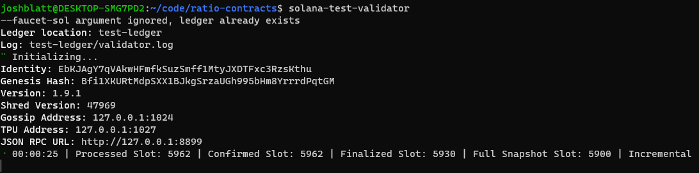

# cdp-contracts

1. Install Node.js (Yarn)
    1. Install [nvm v0.39.1 (as of 2/2/2022)](https://github.com/nvm-sh/nvm#installing-and-updating)

       ```curl -o- https://raw.githubusercontent.com/nvm-sh/nvm/v0.39.1/install.sh | bash```
    2. Use Node v16 (as of 2/2/2022)
         
       ```nvm use 16```
    3. Install [yarn](https://classic.yarnpkg.com/lang/en/docs/install/#mac-stable)
    
       ```npm install --global yarn```

1. Install Solana development environment
    1. Install [Rust](https://doc.rust-lang.org/cargo/getting-started/installation.html)
    
       ```curl https://sh.rustup.rs -sSf | sh```
    2. Install [Solana v1.9.5 (as of 2/2/2022)](https://docs.solana.com/cli/install-solana-cli-tools)
    
       ```sh -c "$(curl -sSfL https://release.solana.com/v1.9.5/install)"```
    3. Install [⚓ Anchor](https://project-serum.github.io/anchor/getting-started/installation.html#install-rust)
       ```cargo install --git https://github.com/project-serum/anchor --tag v0.20.1 anchor-cli --locked```

1. Restart terminals (or create new terminal window via CMD+N)

<br>

## Configure localnet testing

1. Set Solana CLI config to interact with the localnet (at localhost):

   ```solana config set --url localhost```

1. In a separate terminal tab, run `solana-test-validator`. Leave this window open and it should be running and look something like this:
   
   ```zsh
   solana-test-validator
   ```
   

1. In an open terminal tab, navigate to the `cdp-contracts` repo and checkout the desired branch:

   ```cd cdp-contracts && git checkout mainnet_dev```

1. Build and deploy programs (smart contracts) to determine their addresses:

   ```anchor build && anchor deploy```

    - Copy these addresses into Anchor.toml where it says `stable_pool = _ADDRESS_` and `stable_pool_faucet = _ADDRESS_`  respectively.

    - Additionally, copy those addresses into their respective lib.rs files where it says `declare_id!("_ADDRESS_")`

1. Run tests: `anchor test --skip-build && --skip-deploy`

<br>

## Configure devnet testing

1. Set Solana CLI config to work with the devnet:

   ```solana config set --url devnet```

1. In an open terminal tab, navigate to the `cdp-contracts` repo and checkout the desired branch:

   ```cd cdp-contracts && git checkout mainnet_dev```

1. Build and deploy programs (smart contracts):

   ```anchor build && anchor deploy```

   This transaction may fail, saying that there is not enough SOL in your wallet.

     - If so, first copy the address and airdrop to account (ctrl + c to exit the loop):

   ```for i in `seq 1 10`; solana airdrop 2 _your_address_; done```
   
     - And deploy again:
       ```anchor deploy```

     - This will output the Program IDs/addresss for the both `stable-pool` and `stable-pool-faucet` programs.


1. Copy these addresses into Anchor.toml where it says `stable_pool = _ADDRESS_` and `stable_pool_faucet = _ADDRESS_`  respectively.

     - Additionally, copy those addresses into their respective lib.rs files where it says `declare_id!("_ADDRESS_")`

1. Rebuild and deploy programs/smart contracts again: `anchor build && anchor deploy`

If you run into issues, you can reach out to @Anan, @user2 _ or @jkratio
